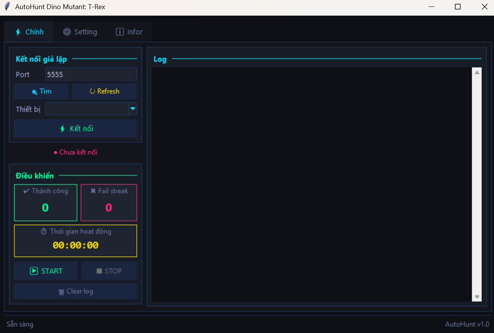

# AutoHunt Dino Mutant: T-Rex 🦖

Tool tự động hóa việc săn Dino trong game

---

## 👀 Giao diện Tool

<p align="center">
  
</p>

---

##  📂 Cấu trúc thư mục

```text
AutoHuntDino/
├── ADB/
│   └── adb.exe                # Trình điều khiển ADB để kết nối thiết bị
├── templates/                 # Thư mục chứa các ảnh mẫu (.png) để nhận diện vật thể
├── setting.json               # Lưu trữ các thông số cấu hình của Bot
├── ui.py                      # Mã nguồn xây dựng giao diện người dùng (GUI)
├── main.py                    # Luồng chạy chính và điều phối logic của Bot
├── function.py                # Thư viện các hàm bổ trợ (xử lý ảnh, lệnh ADB, đọc file)
└── README.md                  # Tài liệu hướng dẫn dự án
```
---

## 🖥 Yêu cầu hệ thống

- Python 3.8 trở lên.
- Giả lập Android (LDPlayer, Bluestacks, Nox, Memu, …) đã bật **ADB debug**.
- ADB đã được cài đặt hoặc tool sẽ tự tìm trong thư mục `AutoHuntDino/ADB/adb.exe`.
- Cài đầy đủ thư viện trong file `requirements.txt`

---

## 🚀 Cài đặt & chạy

1. **Clone repository** (hoặc tải về):
   ```bash
   git clone https://github.com/FMG-FINN205/Auto-Hunt-DinoMutant
   cd AutoHuntDino

2. **Cài đặt thư viện**
   ```bash
   pip install -r requirements.txt
   ```
   hoặc
   ```bash
   pip install opencv-python pillow numpy

3. **Chạy Tool**
   ```bash
   python ui.py

---
